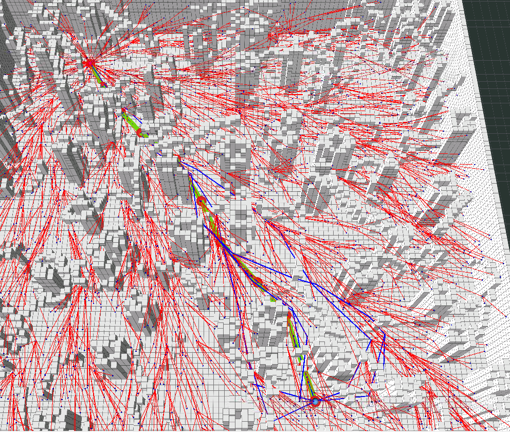
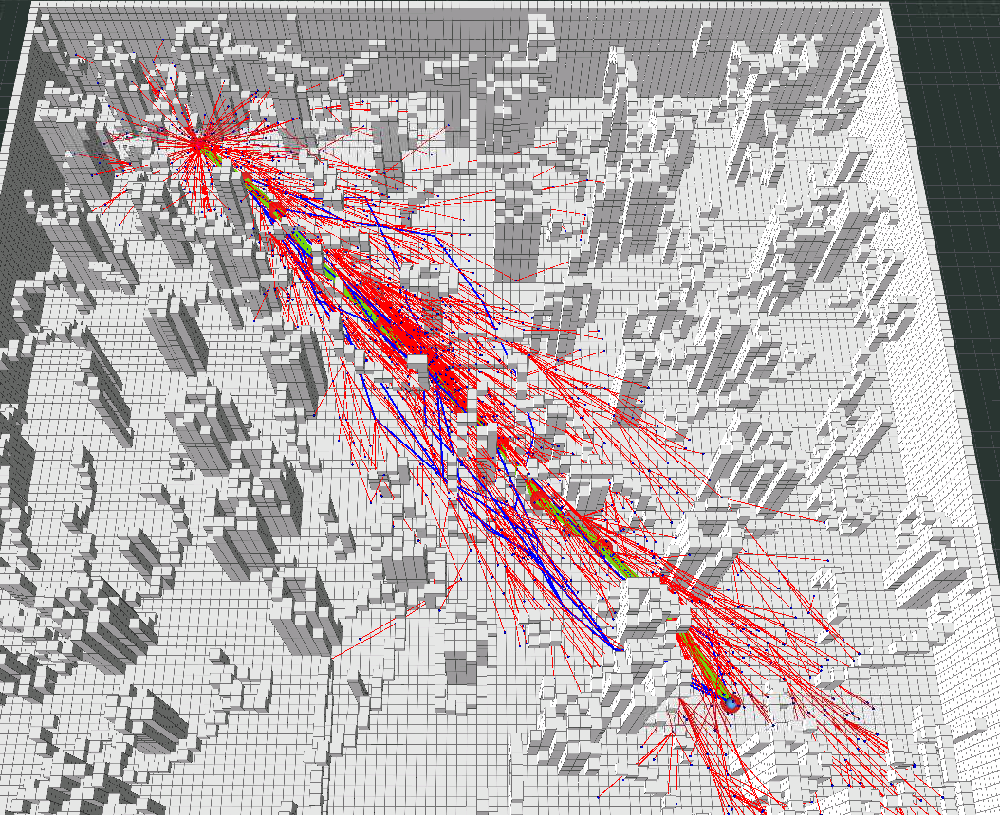

# HW_Motion_Planning_For_Mobile_Robots
<!--  -->
<table>
  <td>  </td>
  <td>  </td>
</table>

```
for (auto &curr_node : neighbour_nodes)
{
  if (!map_ptr_->isSegmentValid(curr_node->x, x_new))
    continue;
  double temp_dist = curr_node->cost_from_start + calDist(curr_node->x, x_new);
  if (temp_dist < min_dist_from_start)
  {
    min_node = curr_node;
    min_dist_from_start = temp_dist;
    cost_from_p = calDist(curr_node->x, x_new);
  }
}
```

Every time we find a new node, we check all the nodes in the vincinity, and check whether this neighbor node would give us a lower cost from start than the current neighbor. If this neighbor node has a lower cost, we compute update this new node's parent to this neighbor node and update the costs accordingly.

```
for (auto &curr_node : neighbour_nodes)
{
  double best_cost_before_rewire = goal_node_->cost_from_start;
  // ! -------------------------------------
  if (!map_ptr_->isSegmentValid(curr_node->x, x_new))
    continue;
  double temp_dist = new_node->cost_from_start + calDist(new_node->x, curr_node->x);
  if (temp_dist < curr_node->cost_from_start)
    changeNodeParent(curr_node, new_node, calDist(new_node->x, curr_node->x));

  // ! -------------------------------------
  if (best_cost_before_rewire > goal_node_->cost_from_start)
  {
    vector<Eigen::Vector3d> curr_best_path;
    fillPath(goal_node_, curr_best_path);
    path_list_.emplace_back(curr_best_path);
    solution_cost_time_pair_list_.emplace_back(goal_node_->cost_from_start, (ros::Time::now() - rrt_start_time).toSec());
  }
}
```

Similar to above, we check the neighbor nodes around the new node. Instead of checking the new node, we check if any of the neighbor nodes can have a lower cost if the neighbor node's parent is the new node. If so, we update this neighbor node's parent to be the new node.

```
void samplingOnce(Eigen::Vector3d &sample, bool ball)
  {
    if (ball)
    {
      // Uniformly Sample in Spherical Coord
      double theta = uniform_rand_pi(gen_);
      double phi = uniform_rand_2pi(gen_);
      double radius = std::pow(uniform_rand_(gen_), 1/3.);
      sample[0] = radius * sin(theta) * cos(phi);
      sample[1] = radius * sin(theta) * sin(phi);
      sample[2] = radius * cos(theta);
    }
    else
    {
      sample[0] = uniform_rand_(gen_);
      sample[1] = uniform_rand_(gen_);
      sample[2] = uniform_rand_(gen_);
      sample.array() *= range_.array();
      sample += origin_;
    }
  };
```
I changed the SamplingOnce method. The boolean ball is true when goal_found == true. Instead of rejection method, I have decided to uniformly sample in the spherical coordinates. Then convert it back to Cartesian Coordinates. 
