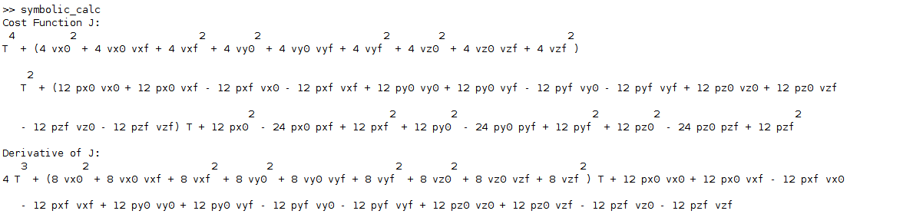
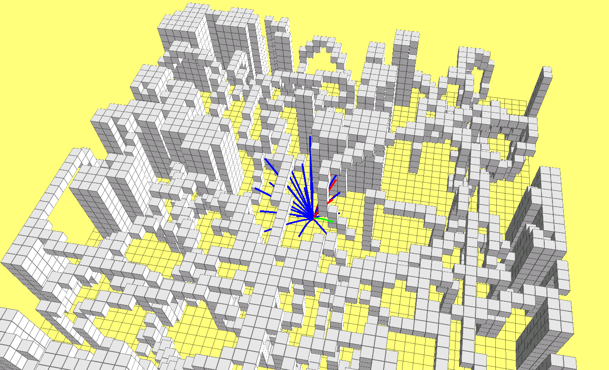

# HW_Motion_Planning_For_Mobile_Robots

Symbolic Solutions are found by Matlab, script is included in the grid_path_searcher/src folder

Forward integration is as follows:

'''
pos += vel * delta_time + 1. / 2 * acc_input * delta_time * delta_time;
vel += acc_input * delta_time;
'''

Then we just implement the result of the symbolic solution in hw_tool

