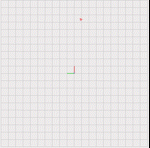

# HW_Motion_Planning_For_Mobile_Robots
<!--  -->

 


```
Eigen::MatrixXd M = Eigen::MatrixXd::Zero(2*pieceNum*3, 2*pieceNum*3);
Eigen::MatrixXd Ei = Eigen::MatrixXd::Zero(2*3, 2*3), Fi = Eigen::MatrixXd::Zero(2*3, 2*3);
```
Initialize M, Ei, and Fi to the right size. Note that M is the same for all x, y, z.

```
    Eigen::MatrixXd F0 = Eigen::MatrixXd::Zero(3, 6);
    Eigen::MatrixXd EM = Eigen::MatrixXd::Zero(3, 6);
    F0 <<  1, 0,   0,  0,  0,  0,
           0, 1,   0,  0,  0,  0,
           0, 0,   2,  0,  0,  0;
    t = timeAllocationVector[pieceNum-1];
    EM <<  1,  t,  t*t,   pow(t,3),    pow(t,4),    pow(t,5),
           0,  1,  2*t, 3*pow(t,2),  4*pow(t,3),  5*pow(t,4),
           0,  0,    2,        6*t, 12*pow(t,2), 20*pow(t,3);
    M.block(0, 0, 3, 6) = F0;
    M.block(3+2*3*(pieceNum-1), 2*3*(pieceNum-1), 3, 6) = EM;
```
Setup boundary condition for the Coefficient Matrix.

```
    for (int i = 0; i < (pieceNum-1); i++)
    {
        int pos_x = 3 + 2*3*i;
        int pos_y = 2*3*i;
        t = timeAllocationVector[i];
        Ei <<  1,  t,  t*t,   pow(t,3),    pow(t,4),    pow(t,5),
               1,  t,  t*t,   pow(t,3),    pow(t,4),    pow(t,5),
               0,  1,  2*t, 3*pow(t,2),  4*pow(t,3),  5*pow(t,4),
               0,  0,    2,        6*t, 12*pow(t,2), 20*pow(t,3),
               0,  0,    0,          6,        24*t, 60*pow(t,2),
               0,  0,    0,          0,          24,       120*t;
        Fi <<  0,  0,    0,          0,           0,           0,
              -1,  0,    0,          0,           0,           0,
               0, -1,    0,          0,           0,           0,
               0,  0,   -2,          0,           0,           0,
               0,  0,    0,         -6,           0,           0,
               0,  0,    0,          0,         -24,           0;
        M.block(pos_x, pos_y, 6, 6) = Ei;
        M.block(pos_x, pos_y+6, 6, 6) = Fi;
    }
```
Setup the intermediate point constraints. The first row of Ei, and Fi is setting up the position constraints to make sure the polynomial pass through the intermediate point. The rest of the rows are to ensure the higher order derivatives of polynomials c_i and c_{i+1} to be the same value.

```
Eigen::PartialPivLU<Eigen::MatrixXd> LU(M);
```
Setup PartialLU solver for Coefficient Matrix M.

